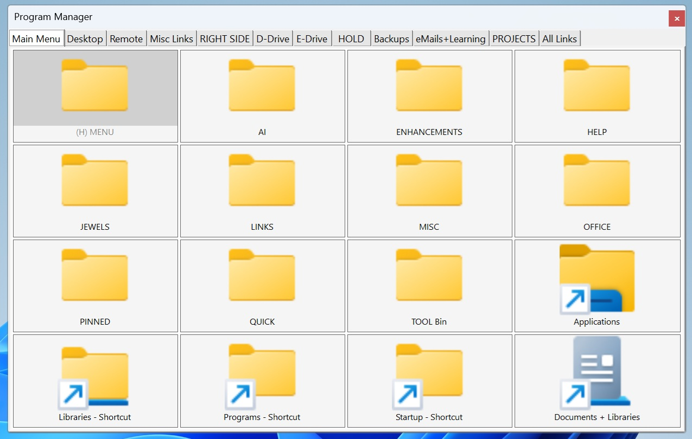
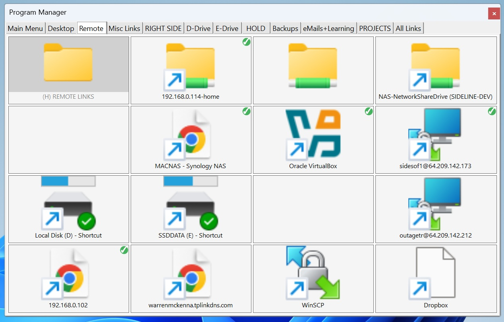
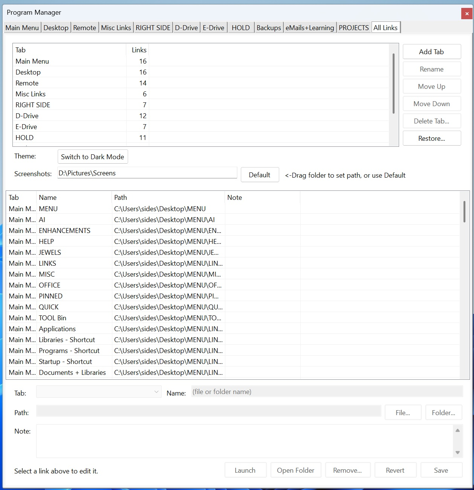

# Program Manager

A lightweight Windows desktop utility for organizing shortcuts to programs, files, and folders in a tabbed grid interface. Built with VB.NET and Windows Forms (.NET 10).
Desktop Folders can be created and loaded into the grid, and then the hidden file attribute set to hide so they no longer appear on the desktop. This is provided as an extended feature to clean up the desktop by providing a secondary way to store files, folders, and links that may otherwise appear on the desktop. Also note that this is a roll-up form by double clicking on the header.

## Features

- **Tabbed grid layout** - As many tabs as you need, each a 4x4 grid (16 shortcut slots), plus an All Links management tab; the tab strip wraps onto extra rows when it gets full
- **Drag and drop** - Drop files and folders from Explorer onto any grid cell
- **Icon rearrangement** - Drag icons between cells to swap positions
- **File and folder support** - Shortcuts to both files and folders with proper Windows icons
- **Launch on double-click** - Open any shortcut directly from the grid or the All Links list
- **Icon notes** - Attach a free-text note to any shortcut via right-click; a green ✓ badge appears on the icon when a note exists; notes are saved to XML and visible in the All Links tab
- **Tab management** - Add, rename, reorder, and delete tabs from the All Links tab list or by right-clicking a tab header; deleting a tab moves its links to another tab (or deletes them after confirmation)
- **Hide/unhide desktop folders** - Toggle the Windows Hidden attribute on desktop folders via right-click
- **Dark / light mode** - Switch themes from the management tab; preference is persisted
- **First-run setup** - On first launch, offers to add Program Manager to your Startup folder and puts a link to a freshly built All Apps shortcuts folder on the first tab
- **Create App Shortcuts** - One click builds a `Documents\All Apps Shortcuts` folder with a shortcut to every app in the Windows All Apps list (including Store apps) and opens it in File Explorer, ready to drag onto the grid
- **Print Screen capture** - While Program Manager is running, pressing `Prt Sc` saves a full-screen capture to `screens_<timestamp>.jpg`; the title bar briefly flashes green to confirm the save (Windows 11)
- **Custom screenshot folder** - Captures save to `Pictures\Screens` by default, or drag a folder onto the **Screenshots** drop-box on the All Links tab to choose your own location; the choice is persisted and a **Use Default Folder** button reverts it
- **Roll-up** - Double-click the title bar to collapse the window to just the title bar
- **Automatic XML backups** - On every launch, both data files are backed up to a `BACKUP-XML` subfolder; the last 10 backups per file are retained, plus a kept copy before every tab delete or restore
- **Restore from backup** - Reload the whole layout from any backup on the All Links tab; the current layout is saved first so a restore can be undone
- **Link editor** - Select a row on the All Links tab to change that link's tab, custom name, path (type, browse, or drop), and note; Save/Revert, Remove, Open Folder, and Launch work on the selected link
- **Missing link detection** - Icons whose file or folder no longer exists are greyed out in place rather than silently removed; double-clicking shows a helpful message and the entry is preserved in XML until you choose to remove it
- **Portable** - All settings stored next to the executable; copy the folder for independent instances

## Screenshots

**Grid tab** - shortcuts to folders and programs in a 4x4 grid, with the tab strip across the top



**Notes and status badges** - a green ✓ in a cell's corner marks a shortcut that has a note



**All Links tab** - manage tabs, restore backups, switch theme, set the screenshot folder, and edit any link



## Download and Run

1. Install the [.NET 10.0 Desktop Runtime](https://dotnet.microsoft.com/en-us/download/dotnet/10.0) if you don't already have it. Choose the **.NET Desktop Runtime** for Windows x64.
2. Download **ProgramManager-vX.Y.Z.zip** from the [latest release](https://github.com/warmac57/ProgramManager/releases/latest).
3. Before extracting, right-click the zip, choose **Properties**, tick **Unblock**, and click **OK**. This stops Windows from flagging the program as downloaded from the internet.
4. Extract the zip to any folder you can write to, such as `Documents\ProgramManager`. Avoid `C:\Program Files`, because Program Manager saves its settings next to the `.exe`.
5. Run **ProgramManager.exe**.

The app isn't code-signed, so the first time you run it Windows SmartScreen may show "Windows protected your PC". Click **More info**, then **Run anyway**.

### Updating

Download the newest zip and extract it over your existing folder, replacing the files. Release zips never contain `ProgramManagerLayout.xml`, `ProgramManagerSettings.xml`, or `BACKUP-XML`, so your tabs, links, and settings are kept.

## Building from Source

### Requirements

- Windows 10/11
- [.NET 10.0 SDK](https://dotnet.microsoft.com/en-us/download/dotnet/10.0)

### Build and Run

```
dotnet build
dotnet run
```

### Usage

1. Drag files or folders from Windows Explorer onto any cell in a grid tab.
2. Double-click an icon to launch it.
3. Drag icons between cells to rearrange.
4. Right-click an icon for options (Open Containing Folder, Edit Note, Hide Folder, Remove).
5. Use the All Links tab to edit any link (select its row), add, rename, reorder, and delete tabs, restore a backup, toggle dark mode, set the screenshot save folder, and view all shortcuts with their notes in a list. Tab commands are also on the right-click menu of each tab header.

For detailed feature documentation, see [Help.md](Help.md).

## Data Files

All data is stored in the application directory (portable, no registry or AppData):

| File | Contents |
|---|---|
| `ProgramManagerLayout.xml` | Shortcut positions, tab names, icon notes, custom link names, dark mode preference, screenshot save folder |
| `ProgramManagerSettings.xml` | Window size, position, and state |
| `BACKUP-XML/` | Timestamped backups of both XML files (last 10 per file) |

> **Note:** The XML data files and `BACKUP-XML/` folder are excluded from source control via `.gitignore` since they contain local file paths.

## Multiple Instances

Copy the entire application folder to a new location to run independent instances. Each copy maintains its own settings and shortcuts.

## Recent Changes

### 2026-10-03

- Tabs are no longer limited to 10: add, rename, reorder, and delete them from the new tab list on the All Links tab or the right-click menu on any tab header
- Deleting a tab with links moves them to a tab you choose (default), or deletes them after a second confirmation; a copy of the layout is saved to `BACKUP-XML` first
- The tab strip wraps onto a second row when the tabs don't fit
- Added **Restore...** on the All Links tab (under the tab buttons)
- New link editor under the All Links list: change the selected link's tab, custom name, path, and note, with Save/Revert, Remove, Open Folder, and Launch; unsaved changes are never lost silently
- Links can have a custom display name (saved as a `name` attribute; blank uses the file name)
- Removed the old fixed tab-name boxes and the Apply button (every change saves immediately)
- Existing layout files load unchanged; a one-time `PreDynamicTabs-ProgramManagerLayout.xml` snapshot is kept in `BACKUP-XML`
- Safer saving: a layout file that fails to load is never overwritten, and saves go through a temporary file
- Main form renamed from `Form1` to `frmMain`

### 2026-06-09

- Added a **Screenshots** drop-box on the All Links tab: drag any folder onto it to choose where `Prt Sc` captures are saved (defaults to `Pictures\Screens`)
- The chosen folder is persisted in `ProgramManagerLayout.xml` and restored on launch; a **Use Default Folder** button reverts it, and a missing saved folder falls back to the default
- Only folders are accepted on the drop-box; dropping a file is ignored with a brief prompt

### 2026-06-08

- Added background Print Screen capture: while the app runs, pressing `Prt Sc` saves a full-screen JPEG to `Pictures\Screens\` (filenames stamped `screens_yyyy-MM-dd_HH-mm-ss.jpg`, with a counter appended if two captures land in the same second)
- The title bar flashes green for a moment to confirm each save (uses the Windows 11 DWM caption color; no-op on Windows 10)
- The screen is captured directly by the app, so the clipboard is left untouched and all monitors are included

### 2026-04-23

- Added a 10th icon grid tab titled "Tab 10" (renameable via All Links settings panel), increasing total shortcut slots to 160

### 2026-04-14

- Missing-link icons are now greyed out and kept in the grid rather than silently dropped; they survive saves and restarts until explicitly removed

### 2026-03-30

- Added a 9th icon grid tab titled "eMails" (renameable via All Links settings panel), increasing total shortcut slots to 144

### 2026-02-24

- Icons with a note now display a green ✓ badge in the top-right corner of the icon

### 2026-02-20

- Added per-icon note field, editable via right-click "Edit Note..." dialog; notes saved in XML and shown in the All Links tab
- Added automatic XML backups to `BACKUP-XML/` on every launch (last 10 kept per file)
- Excluded runtime data files from source control via `.gitignore`

For the full changelog, see [ChangeLog.md](ChangeLog.md).
